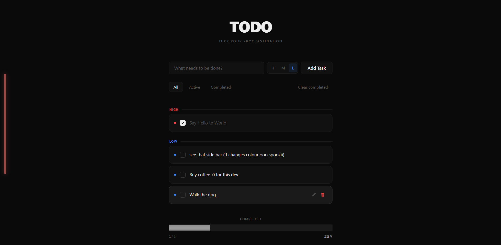

# Todo App

A dark, priority-driven todo application built with Next.js, React, and TypeScript. The app keeps tasks in localStorage, groups active work by priority, tracks completion progress, and preserves the compact UI from the original single-page experience.

## Preview

<p align="center">
  
</p>

## Features

- Add tasks with high, medium, or low priority.
- Toggle tasks between active and completed.
- Edit task text and priority inline.
- Delete individual tasks.
- Filter by all, active, or completed tasks.
- Clear all completed tasks.
- Sort tasks by priority.
- Show priority section headers for all and active views.
- Display completion progress and remaining item count.
- Persist tasks in `localStorage`.
- Show a fixed workload indicator that changes color by active task count.

## Tech Stack

- Next.js 15 App Router
- React 19
- TypeScript
- Global vanilla CSS
- Vitest
- jsdom
- ESLint 9 with `eslint-config-next`
- Prettier

## Project Architecture

The application uses the App Router for the route shell and a client-only todo tree for browser storage parity. The page loads a small client wrapper that dynamically imports the todo app with server-side rendering disabled, preventing localStorage hydration mismatch.

State lives in `TodoProvider`, backed by `useReducer` and exposed through `useTodos()`. Pure task behavior remains framework-independent in `lib/`: reducers, selectors, repository, validation, ID generation, and storage wrappers can be tested without React.

Styling is intentionally global. The original CSS cascade is preserved by importing each stylesheet from `app/layout.tsx` in a fixed order.

## Folder Structure

```text
aitodo/
├── app/
│   ├── globals.css
│   ├── layout.tsx
│   └── page.tsx
├── components/
│   ├── icons/
│   ├── TodoApp.tsx
│   ├── TodoInput.tsx
│   ├── TaskList.tsx
│   └── ...
├── lib/
│   ├── reducer.ts
│   ├── selectors.ts
│   ├── repository.ts
│   ├── useTodos.tsx
│   └── ...
├── styles/
│   ├── tokens.css
│   ├── base.css
│   ├── layout.css
│   └── components/
├── tests/
│   ├── reducer.test.ts
│   ├── repository.test.ts
│   └── selectors.test.ts
├── next.config.mjs
├── tsconfig.json
├── vitest.config.ts
└── package.json
```

## Installation

```bash
npm install
```

## Development Commands

```bash
npm run dev
```

The development server runs at `http://localhost:3000` by default.

## Build Commands

```bash
npm run build
npm run start
```

`npm run build` creates the optimized `.next/` production output. `npm run start` serves that production build.

## Test Commands

```bash
npm test
npm run test:watch
```

The test suite covers task reducers, selectors, repository persistence, invalid storage data, and localStorage round trips.

## Environment Variables

No application-specific environment variables are required.

The npm scripts set `TMPDIR=/tmp` so Next.js and Vitest use a writable temp directory in this WSL-based workspace.

## Scripts

- `dev`: starts the Next.js development server.
- `build`: creates a production Next.js build.
- `start`: serves the production build.
- `lint`: runs ESLint across the project.
- `test`: runs the Vitest suite once.
- `test:watch`: runs Vitest in watch mode.
- `format`: formats project files with Prettier.

## Design Decisions

- The todo UI is client-only to match browser-first localStorage behavior and avoid hydration differences.
- Domain logic is kept in pure TypeScript modules so behavior stays easy to test.
- React Context plus `useReducer` replaces the previous observer store while keeping a single application state source.
- Global CSS is imported in the original cascade order to preserve visual parity.
- Inline SVG React components replace DOM-created SVG icons without changing their geometry.
- Vitest remains the test runner because the preserved logic tests are fast and framework-independent.

## Future Improvements

- Add browser-level interaction tests for editing, filtering, and persistence.
- Add optional import/export for saved tasks.
- Add keyboard shortcuts for faster task management.
